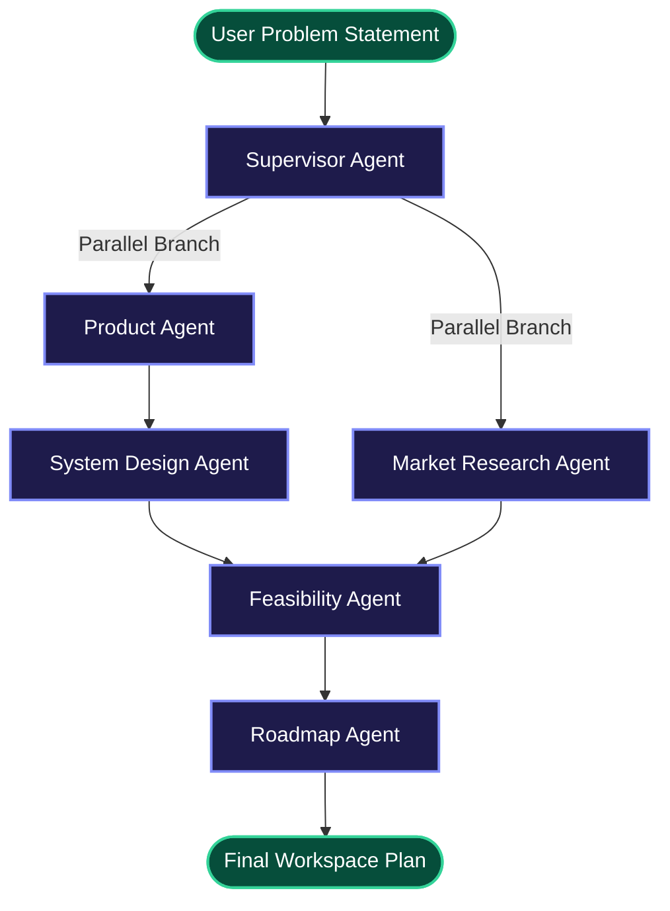

# Agentic Product Planner & Systems Design Canvas

An advanced, agentic pair-programming platform that automates high-level product planning, market research, feasibility analysis, system architecture mapping, and roadmap execution. Built on a multi-agent orchestration architecture utilizing **FastAPI**, **LangGraph**, **Celery**, and **Next.js**.

---

## 🏗️ System DAG Architecture

The orchestrator utilizes a parallel-join Directed Acyclic Graph (DAG) state machine to execute analysis phases asynchronously and save outputs in PostgreSQL:



---

## 🛠️ Specialized Agents Directory

All specialized planning agents inherit from a unified provider wrapper:
*   [base_agent.py](file:///c:/Users/jhanv/Desktop/FINAL%20YEAR%20PROJECT/backend/app/agents/base_agent.py): Selects LLM instances dynamically, handles Google Gemini (`gemini-1.5-flash`) or Hugging Face Inference API models (llama 3 8B), and cleans raw outputs.
*   [supervisor.py](file:///c:/Users/jhanv/Desktop/FINAL%20YEAR%20PROJECT/backend/app/agents/supervisor.py): Deconstructs problem complexity and plans domain focuses.
*   [product_agent.py](file:///c:/Users/jhanv/Desktop/FINAL%20YEAR%20PROJECT/backend/app/agents/product_agent.py): Outlines product visions, epic features, user pain points, and NFR metrics.
*   [market_agent.py](file:///c:/Users/jhanv/Desktop/FINAL%20YEAR%20PROJECT/backend/app/agents/market_agent.py): Compiles key competitors, unserved market gaps, and differentiation parameters.
*   [system_design_agent.py](file:///c:/Users/jhanv/Desktop/FINAL%20YEAR%20PROJECT/backend/app/agents/system_design_agent.py): Generates systems architecture Markdown reports and nodes/edges templates for React Flow.
*   [feasibility_agent.py](file:///c:/Users/jhanv/Desktop/FINAL%20YEAR%20PROJECT/backend/app/agents/feasibility_agent.py): Details delivery risk scales, skill resource constraints, and mitigations.
*   [roadmap_agent.py](file:///c:/Users/jhanv/Desktop/FINAL%20YEAR%20PROJECT/backend/app/agents/roadmap_agent.py): Structures milestone timelines, MVP scope, and future scale V2 requirements.

---

## 🚀 How to Run the Program

You can spin up the entire application stack using **Docker Compose** or run the backend and frontend services **locally**.

### 📋 Prerequisites
*   [Docker Desktop](https://www.docker.com/products/docker-desktop/) (Recommended)
*   [Python 3.12+](https://www.python.org/downloads/)
*   [Node.js v20+](https://nodejs.org/)
*   A **Supabase** project (for JWT user session authentication)
*   A **Google Gemini API Key** or **Hugging Face Hub Token**

---

### Method 1: Containerized Execution (Recommended)

1.  **Configure Environment Variables**:
    Create a `.env` file in the root directory by copying the example:
    ```bash
    cp .env.example .env
    ```
    Populate the following credentials in the newly created `.env` file:
    *   `GEMINI_API_KEY` (or `HUGGINGFACE_API_KEY`)
    *   `SUPABASE_URL` & `SUPABASE_JWT_SECRET`
    *   `NEXT_PUBLIC_SUPABASE_URL` & `NEXT_PUBLIC_SUPABASE_ANON_KEY`

2.  **Start Services**:
    Build and launch all services (Database, Cache, API, Celery Worker, Frontend) in detached mode:
    ```bash
    docker-compose up -d --build
    ```

3.  **Run Migrations**:
    Apply the database schemas inside the API container:
    ```bash
    docker-compose exec api alembic upgrade head
    ```

4.  **Access App**:
    *   **Frontend Interface**: [http://localhost:3000](http://localhost:3000)
    *   **Backend REST Docs**: [http://localhost:8000/docs](http://localhost:8000/docs)

---

### Method 2: Local Host Development Execution

If you prefer to run services locally on your machine:

#### 1. Setup the Database and Cache
Ensure Postgres and Redis services are active locally. You can update `DATABASE_URL` and `REDIS_URL` settings in the `.env` to match your local connection strings.

#### 2. Run Backend API Server
Navigate to the `backend` directory, install Python dependencies, run database migrations, and launch Uvicorn:
```bash
cd backend
pip install -r requirements.txt
alembic upgrade head
uvicorn app.main:app --host 127.0.0.1 --port 8000 --reload
```

#### 3. Run Celery Background Worker
Open a new terminal session, navigate to the `backend` folder, and trigger Celery:
```bash
cd backend
celery -A app.workers.celery_app.celery worker --loglevel=info
```

#### 4. Run Frontend Client
Navigate to the `frontend` directory, install packages, and spin up the Next.js development server:
```bash
cd frontend
npm install
npm run dev
```
Open [http://localhost:3000](http://localhost:3000) on your web browser.

---

## 🗂️ Project Directory Layout

```
.
├── backend/
│   ├── alembic/                    # Database migrations configurations
│   ├── app/
│   │   ├── agents/                 # Specialized agent classes (LLM logic)
│   │   ├── api/                    # REST endpoints and deps injections
│   │   ├── core/                   # DB connection setup and config settings
│   │   ├── graph/                  # LangGraph state definitions and DAG workflow pipeline
│   │   ├── models/                 # SQLAlchemy schema models
│   │   ├── schemas/                # Pydantic validation schemas
│   │   └── workers/                # Celery worker task configurations
│   └── requirements.txt            # Python dependencies
├── frontend/
│   ├── app/                        # Next.js App Router (Dashboard & Workspaces)
│   ├── lib/                        # Supabase auth integrations and fetch clients
│   └── package.json                # Frontend package configurations
└── docker-compose.yml              # Services orchestration configurations
```
