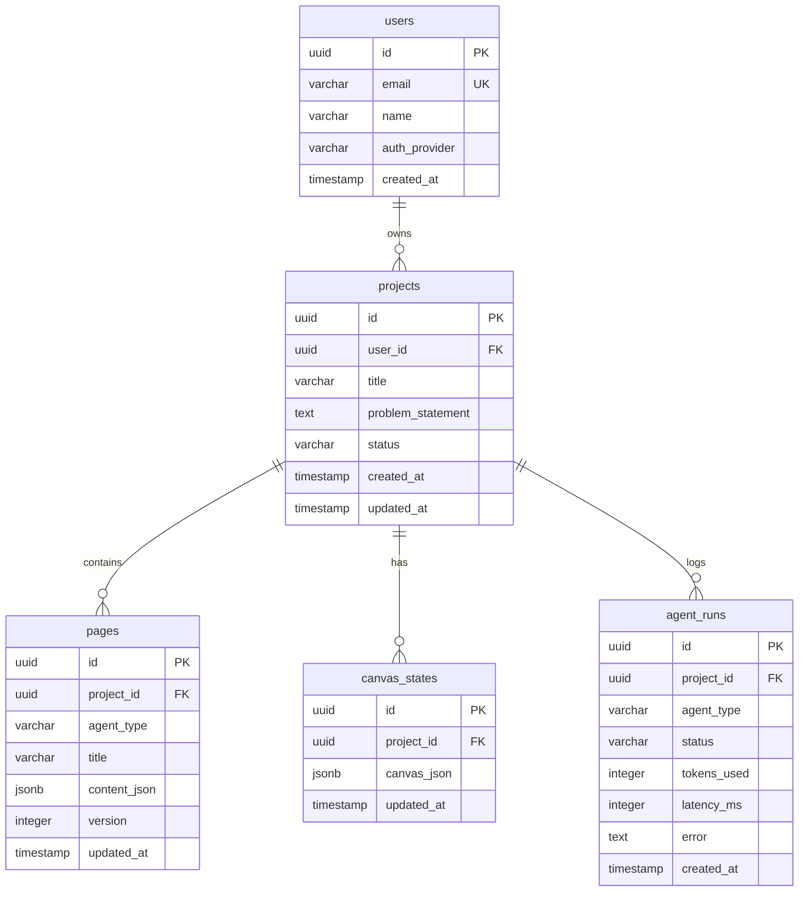
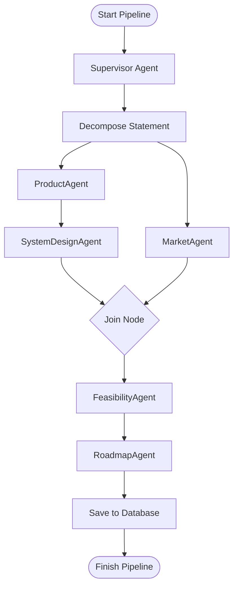
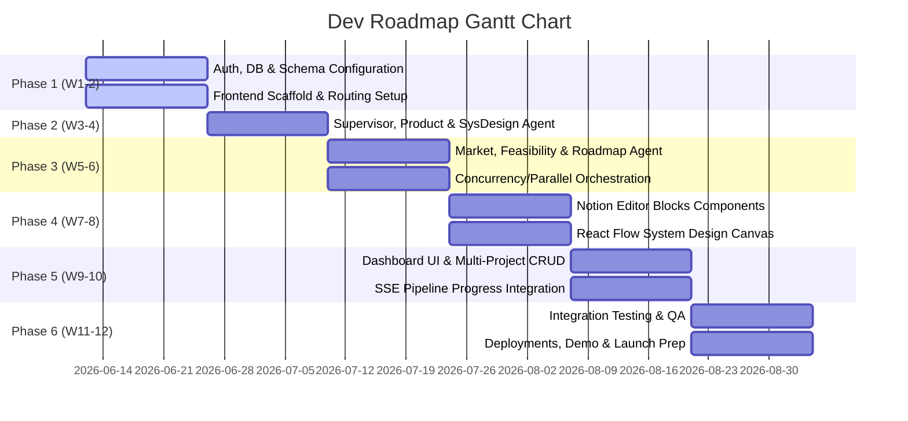

# Technical Implementation Blueprint: Agentic AI-Based Automated Product Planning & System Design Platform

This document outlines the end-to-end technical architecture, system design, data modeling, agent orchestration patterns, and security constraints for building the automated product planning and system design platform.

---

## 1. Requirements Analysis

### Functional Requirements
*   **Single-Input Agentic Pipeline**: The system must accept a raw, unstructured problem statement (e.g., "Build an Uber for pets") and trigger a background workflow that orchestrates multiple LLM-based agents.
*   **Orchestrated Agent Execution**: A central Supervisor LLM decomposes the inputs and coordinates five specialized agents:
    1.  **Product Preparation Agent**: Generates product vision, target user personas, core features, and non-functional requirements (NFRs).
    2.  **System Design Agent**: Produces a High-Level Design (HLD) text representation and outputs a structured JSON graph schema (nodes, edges, node-types, positions) to feed the canvas.
    3.  **Market Research Agent**: Maps out competitors, identifies market gaps, and formulates a product differentiation strategy (integrates with web search APIs).
    4.  **Feasibility Analysis Agent**: Estimates technical risk, timeline constraints, team skill gaps, and general project feasibility.
    5.  **Roadmap & Execution Agent**: Constructs a multi-phase implementation roadmap (MVP vs. V2 scope) with milestones.
*   **Structured, Predefined Notion-Style Templates**: Each agent maps its output to a rich-text document structured with clear markdown blocks (headings, lists, callouts).
*   **Interactive System Design Canvas**: The system converts the System Design Agent's JSON output into an interactive, editable flow diagram (nodes for databases, APIs, workers; edges for communication). Users must be able to add, delete, rename, and reconnect elements manually.
*   **Multi-Project Account Dashboard**: Users can create, delete, list, and view projects. Each project acts as an isolated workspace containing its problem statement, status, generated pages, and canvas layout.

### Non-Functional Requirements
*   **Asynchronous Parallel Agent Execution**: Agents without direct data dependencies (e.g., `ProductAgent` and `MarketAgent`) must execute concurrently.
*   **LLM Cost-Awareness**: The system must implement hard token budgets per agent, track and log token metrics, and utilize caching mechanisms (Redis) to avoid re-generating decompositions for identical or near-identical problem statements.
*   **Pipeline Performance**: The end-to-end multi-agent pipeline must complete execution in under **90 seconds** for the MVP.
*   **Secure Multi-Tenant Isolation**: Row Level Security (RLS) or application-level JWT filters must ensure users can only read/write their own projects, pages, and canvas states.
*   **Stateless Scaling**: The backend API instances must be completely stateless, delegating execution state to PostgreSQL and Redis. LangGraph agents must run inside background worker pools (Celery) that scale horizontally.

### Out of Scope (MVP)
*   **Real-time collaborative editing** (Yjs/operational transformation).
*   **Offline mode** and local synchronization.
*   **Fine-tuning/training** custom LLMs.
*   **Advanced force-directed diagram auto-layout** algorithms (a basic structured tree/grid layout is sufficient).
*   **A fully-featured Notion clone** (standard Markdown/block rendering with inline edits is the target).

---

## 2. Tech Stack Decision & Justification

| Layer | Technology | Selection | Architectural Justification |
| :--- | :--- | :--- | :--- |
| **Frontend** | Next.js 14 (App Router) | **Selected** | Next.js App Router optimizes page loads with Server Components, handles nested routes (e.g., `/project/[id]/canvas`), and simplifies client-side state transitions with built-in layouts. |
| **Styling** | TailwindCSS + shadcn/ui | **Selected** | Rapid UI construction using fully accessible headless primitives. Avoids component library bloat while keeping a polished, modern, glassmorphic aesthetic. |
| **Canvas** | React Flow | **React Flow** | **Selection & Justification**: **React Flow** is chosen over Excalidraw. While Excalidraw is excellent for raw hand-drawn sketching, React Flow is programmatically driven by a structured node-and-edge graph schema. The System Design Agent outputs a rigid schema of structural entities (e.g., `nodes: [{id: '1', type: 'database', data: {label: 'Postgres'}}]`), which React Flow can instantly ingest, lay out, and render with custom React components (custom Database, API Gateway, Worker node UIs). React Flow handles viewport zoom, drag-and-drop nodes, and edge connections out of the box with precise event handlers, whereas Excalidraw integration requires parsing raw drawing shapes and coordinates, making precise node/edge manipulation via code complex and error-prone. |
| **Backend** | FastAPI (Python) | **Selected** | High-performance async capabilities, native Pydantic integration for data validation, auto-generated OpenAPI documentation, and seamless compatibility with Python AI runtimes. |
| **Agent Framework**| LangGraph | **Selected** | **Justification**: Unlike standard LangChain Agents which follow a single-loop ReAct pattern, LangGraph supports stateful, multi-agent graphs with cycles, parallel branches, and explicit control flow. Our architecture demands a strict DAG execution sequence (parallel branches for Product/Market, sequential system design, aggregated feasibility). LangGraph models this graph topology naturally as nodes and edges with built-in state management. |
| **LLM** | OpenAI GPT-4o (Primary) | **Selected** | Standardized model with superior structured JSON output formatting (Structured Outputs JSON schema validation). A service abstraction layer will wrap the model, allowing hot-swapping with Gemini 1.5 Pro or Claude 3.5 Sonnet. |
| **Database** | PostgreSQL | **Selected** | Relational integrity is key for multi-project ownership, versioned document pages, and user metadata. Supported by excellent SQLAlchemy/Alembic tooling. |
| **Auth** | Supabase Auth | **Supabase Auth** | **Selection & Justification**: **Supabase Auth** is chosen. It provides seamless JWT creation, secure session handling, and directly integrates with PostgreSQL. RLS policies can be written on the Postgres tables to enforce data security directly at the database layer. This reduces authentication overhead in the FastAPI layer compared to Clerk, while avoiding Clerk's pricing models at scale. |
| **Background Jobs** | Celery + Redis | **Celery + Redis** | **Selection & Justification**: **Celery + Redis** is chosen over simple FastAPI BackgroundTasks. LLM pipelines are long-running (up to 90 seconds) and compute-heavy. FastAPI BackgroundTasks run in the same process/event loop as the API, meaning high concurrency would block request processing. Celery isolates execution to independent worker processes, supporting horizontal scaling, retry configurations, task progress tracking (for SSE), and worker isolation. |
| **Storage** | Supabase Storage | **Selected** | S3-compatible object store. Used for storing static exports of canvas diagrams (PNG/SVG) and project ZIP bundles, utilizing the same auth credentials as Supabase Auth. |
| **Deployment** | Docker Compose → Cloud Run | **Selected** | Single-command local environment running database, Redis, frontend, backend, and Celery workers. Production deploys to GCP Cloud Run for serverless auto-scaling of backend containers. |

---

## 3. Database Schema Design

The following schema maps the relational model in PostgreSQL.



### PostgreSQL DDL (Data Definition Language)

```sql
-- Create custom ENUMs
CREATE TYPE project_status AS ENUM ('queued', 'processing', 'done', 'failed');
CREATE TYPE agent_type AS ENUM ('product', 'system_design', 'market', 'feasibility', 'roadmap');
CREATE TYPE agent_run_status AS ENUM ('started', 'completed', 'failed');

-- Table: users
CREATE TABLE users (
    id UUID PRIMARY KEY,
    email VARCHAR(255) UNIQUE NOT NULL,
    name VARCHAR(255),
    auth_provider VARCHAR(50) NOT NULL,
    created_at TIMESTAMP WITH TIME ZONE DEFAULT CURRENT_TIMESTAMP NOT NULL
);

-- Table: projects
CREATE TABLE projects (
    id UUID PRIMARY KEY DEFAULT gen_random_uuid(),
    user_id UUID NOT NULL REFERENCES users(id) ON DELETE CASCADE,
    title VARCHAR(255) NOT NULL,
    problem_statement TEXT NOT NULL,
    status project_status DEFAULT 'queued' NOT NULL,
    created_at TIMESTAMP WITH TIME ZONE DEFAULT CURRENT_TIMESTAMP NOT NULL,
    updated_at TIMESTAMP WITH TIME ZONE DEFAULT CURRENT_TIMESTAMP NOT NULL
);

-- Table: pages
CREATE TABLE pages (
    id UUID PRIMARY KEY DEFAULT gen_random_uuid(),
    project_id UUID NOT NULL REFERENCES projects(id) ON DELETE CASCADE,
    agent_type agent_type NOT NULL,
    title VARCHAR(255) NOT NULL,
    content_json JSONB NOT NULL,
    version INTEGER DEFAULT 1 NOT NULL,
    updated_at TIMESTAMP WITH TIME ZONE DEFAULT CURRENT_TIMESTAMP NOT NULL,
    CONSTRAINT unique_project_agent_page UNIQUE (project_id, agent_type)
);

-- Table: canvas_states
CREATE TABLE canvas_states (
    id UUID PRIMARY KEY DEFAULT gen_random_uuid(),
    project_id UUID UNIQUE NOT NULL REFERENCES projects(id) ON DELETE CASCADE,
    canvas_json JSONB NOT NULL, -- structured for React Flow (nodes, edges, viewport)
    updated_at TIMESTAMP WITH TIME ZONE DEFAULT CURRENT_TIMESTAMP NOT NULL
);

-- Table: agent_runs
CREATE TABLE agent_runs (
    id UUID PRIMARY KEY DEFAULT gen_random_uuid(),
    project_id UUID NOT NULL REFERENCES projects(id) ON DELETE CASCADE,
    agent_type agent_type NOT NULL,
    status agent_run_status NOT NULL,
    tokens_used INTEGER DEFAULT 0 NOT NULL,
    latency_ms INTEGER DEFAULT 0 NOT NULL,
    error TEXT,
    created_at TIMESTAMP WITH TIME ZONE DEFAULT CURRENT_TIMESTAMP NOT NULL
);

-- Indexing Strategy
CREATE INDEX idx_projects_user_id ON projects(user_id);
CREATE INDEX idx_projects_status ON projects(status);
CREATE INDEX idx_pages_project_id ON pages(project_id);
CREATE INDEX idx_agent_runs_project_id ON agent_runs(project_id);
CREATE INDEX idx_pages_content_jsonb_gin ON pages USING gin (content_json);
```

---

## 4. Agent Architecture & Orchestration Design

The core orchestration relies on **LangGraph**. A Supervisor node acts as a router/compiler, while specialized nodes process aspects of the plan.

### Execution Control Flow



### Graph State Schema (Python Pydantic)

The `GraphState` dict contains the inputs, intermediate schemas, and accumulated token/latency costs.

```python
from pydantic import BaseModel, Field
from typing import List, Dict, Any, Optional

class CanvasNode(BaseModel):
    id: str
    type: str  # e.g., 'api_gateway', 'database', 'microservice'
    data: Dict[str, Any]
    position: Dict[str, float]

class CanvasEdge(BaseModel):
    id: str
    source: str
    target: str
    animated: bool = False
    label: Optional[str] = None

class CanvasSchema(BaseModel):
    nodes: List[CanvasNode]
    edges: List[CanvasEdge]

class GraphState(BaseModel):
    project_id: str
    problem_statement: str
    
    # Supervisor Decomposition Plan
    execution_plan: Optional[str] = None
    
    # Agent Outputs
    product_data: Optional[Dict[str, Any]] = None
    market_data: Optional[Dict[str, Any]] = None
    system_design_text: Optional[str] = None
    system_design_canvas: Optional[CanvasSchema] = None
    feasibility_data: Optional[Dict[str, Any]] = None
    roadmap_data: Optional[Dict[str, Any]] = None
    
    # Telemetry and Execution Logs
    token_usage: Dict[str, int] = Field(default_factory=lambda: {
        "prompt_tokens": 0, "completion_tokens": 0, "total_tokens": 0
    })
    latency_ms: Dict[str, int] = Field(default_factory=dict)
```

### Per-Agent System Prompt Outline & Structured JSON Format

#### 1. SupervisorAgent
```
SYSTEM: You are the Lead Architect Supervisor. Your job is to analyze the raw problem statement: {problem_statement}.
Decompose this statement into key dimensions (Primary Goal, Target Domain, Complexity Scale).
Output a structured plan outlining the tone and technical assumptions for downstream agents.
```

#### 2. ProductAgent
```
SYSTEM: You are the Principal Product Owner. Analyze the problem: {problem_statement}.
Using the supervisor's guidelines, generate:
- Vision Statement
- Target User Personas (minimum 2)
- Feature List grouped by Epic (Functional Blocks)
- Non-Functional Requirements (Performance, Scale, Security)
Your response must strictly match the following JSON structure:
{
  "vision": "string",
  "personas": [{"role": "string", "needs": ["string"], "frustrations": ["string"]}],
  "features": [{"epic": "string", "items": [{"name": "string", "desc": "string"}]}],
  "nfrs": [{"category": "string", "spec": "string"}]
}
```

#### 3. SystemDesignAgent
```
SYSTEM: You are the Lead Systems Architect. Review the Product Vision and Features: {product_data}.
Generate a comprehensive HLD markdown report AND a structured JSON Graph representing nodes and edges for React Flow.
Supported nodes types: 'client', 'api_gateway', 'auth_service', 'load_balancer', 'microservice', 'database', 'cache', 'message_queue', 'worker'.
Positions must be mapped logically (e.g. client at x: 100, gateway at x: 300, database at x: 700).
Your JSON output must match:
{
  "hld_markdown": "string",
  "canvas": {
    "nodes": [{"id": "string", "type": "string", "data": {"label": "string"}, "position": {"x": 0.0, "y": 0.0}}],
    "edges": [{"id": "string", "source": "string", "target": "string", "label": "string"}]
  }
}
```

#### 4. MarketAgent
```
SYSTEM: You are the Lead Market Researcher. Analyze the problem statement: {problem_statement} and product data: {product_data}.
Identify key competitors (based on internal knowledge + web searches if enabled).
List features, gaps, and recommend a differentiation matrix.
Output JSON structure:
{
  "competitors": [{"name": "string", "strengths": ["string"], "weaknesses": ["string"]}],
  "gaps": ["string"],
  "differentiation": "string"
}
```

#### 5. FeasibilityAgent
```
SYSTEM: You are the Feasibility Director. Analyze product specifications, competitor landscape, and systems architecture.
Assess:
- Technical implementation risks (High, Medium, Low)
- Resource skill bottlenecks
- MVP development constraints
Output JSON:
{
  "risks": [{"risk": "string", "impact": "string", "mitigation": "string"}],
  "resource_requirements": ["string"],
  "technical_feasibility_summary": "string"
}
```

#### 6. RoadmapAgent
```
SYSTEM: You are the Agile Program Manager. Review all generated artifacts (Product, Architecture, Feasibility, Market).
Generate an execution roadmap divided into 3 milestones:
- Milestone 1: Core Foundation (MVP)
- Milestone 2: Functional Core
- Milestone 3: Scale & Launch (V2)
Output JSON:
{
  "phases": [{"phase_name": "string", "duration": "string", "deliverables": ["string"]}],
  "mvp_scope": ["string"],
  "v2_scope": ["string"]
}
```

---

## 5. API Structure

The API layer is built with FastAPI. All endpoints authenticate requests using Supabase JWT tokens via standard Bearer headers.

### Endpoint Matrix

#### `POST /api/projects`
*   **Description**: Creates a new project and triggers the background Celery agentic pipeline.
*   **Request Body**:
    ```json
    {
      "title": "Uber for Pets",
      "problem_statement": "A platform connecting pet owners with verified drivers..."
    }
    ```
*   **Response Code**: `202 Accepted`
*   **Response Body**:
    ```json
    {
      "project_id": "c30f4e3c-83b8-45a7-96a8-f9b88e1a1411",
      "status": "queued",
      "message": "Pipeline execution initiated successfully"
    }
    ```

#### `GET /api/projects`
*   **Description**: Retrieves a list of projects owned by the authenticated user.
*   **Response Code**: `200 OK`
*   **Response Body**:
    ```json
    [
      {
        "id": "c30f4e3c-83b8-45a7-96a8-f9b88e1a1411",
        "title": "Uber for Pets",
        "status": "processing",
        "created_at": "2026-06-11T12:00:00Z"
      }
    ]
    ```

#### `GET /api/projects/:id`
*   **Description**: Fetch detailed info of a single project.
*   **Response Code**: `200 OK` / `404 Not Found`
*   **Response Body**:
    ```json
    {
      "id": "c30f4e3c-83b8-45a7-96a8-f9b88e1a1411",
      "title": "Uber for Pets",
      "problem_statement": "...",
      "status": "done",
      "created_at": "...",
      "updated_at": "..."
    }
    ```

#### `GET /api/projects/:id/pages`
*   **Description**: Retrieve all generated pages (Product, Market, Feasibility, etc.) linked to the project.
*   **Response Code**: `200 OK`
*   **Response Body**:
    ```json
    [
      {
        "id": "page-uuid-1",
        "agent_type": "product",
        "title": "Product Plan & Vision",
        "content_json": {},
        "version": 1
      }
    ]
    ```

#### `GET /api/projects/:id/pages/:type`
*   **Description**: Get content for a specific agent page.
*   **Path Parameter**: `:type` (e.g. `product`, `system_design`, `market`, `feasibility`, `roadmap`)
*   **Response Code**: `200 OK`

#### `PUT /api/projects/:id/pages/:type`
*   **Description**: Allows the user to modify and save the document blocks generated by the agent. Increments document `version`.
*   **Request Body**:
    ```json
    {
      "title": "Updated Product Plan",
      "content_json": { "blocks": [...] }
    }
    ```
*   **Response Code**: `200 OK`

#### `GET /api/projects/:id/canvas`
*   **Description**: Fetches the structured node/edge canvas JSON representation for React Flow.
*   **Response Code**: `200 OK`
*   **Response Body**:
    ```json
    {
      "project_id": "c30f4e3c-83b8-45a7-96a8-f9b88e1a1411",
      "nodes": [],
      "edges": []
    }
    ```

#### `PUT /api/projects/:id/canvas`
*   **Description**: Save manual canvas changes (repositioned nodes, new links).
*   **Request Body**: Same format as `GET /api/projects/:id/canvas`
*   **Response Code**: `200 OK`

#### `GET /api/projects/:id/status`
*   **Description**: Real-time status update endpoint using Server-Sent Events (SSE) to stream pipeline progress updates (e.g., `Supervisor initialized -> Product Agent processing -> Market Agent processing -> Finished`).
*   **Response Type**: `text/event-stream`
*   **Event Stream Output Example**:
    ```
    event: status_update
    data: {"status": "processing", "agent": "product", "progress_pct": 20}

    event: status_update
    data: {"status": "processing", "agent": "system_design", "progress_pct": 60}
    ```

#### `DELETE /api/projects/:id`
*   **Description**: Deletes a project and all associated records.
*   **Response Code**: `204 No Content`

---

## 6. Project Directory Structure

```
/
├── docker-compose.yml
├── .env.example
│
├── frontend/                        # Next.js 14 Web Application
│   ├── package.json
│   ├── tsconfig.json
│   ├── tailwind.config.js
│   ├── app/
│   │   ├── layout.tsx               # Root Layout with Supabase Auth Provider
│   │   ├── globals.css              # Custom styling (glassmorphism tokens)
│   │   ├── page.tsx                 # Home / Landing Page
│   │   ├── (auth)/
│   │   │   ├── login/page.tsx       # Sign-in UI
│   │   │   └── signup/page.tsx      # Registration UI
│   │   ├── dashboard/
│   │   │   └── page.tsx             # Project workspace lists & stats
│   │   └── project/[id]/
│   │       ├── layout.tsx           # Layout with project sidebar navigation
│   │       ├── page.tsx             # Project summary and status monitoring
│   │       ├── canvas/
│   │       │   └── page.tsx         # React Flow interactive design canvas
│   │       └── [pageType]/
│   │           └── page.tsx         # Notion-style document block editor
│   ├── components/
│   │   ├── editor/
│   │   │   ├── block-editor.tsx     # Custom editor framework
│   │   │   └── blocks/              # Rich text node templates
│   │   ├── canvas/
│   │   │   ├── custom-nodes/        # Custom Database, API Gateway, Worker node UIs
│   │   │   └── flow-canvas.tsx      # React Flow instance integration
│   │   ├── dashboard/
│   │   │   └── project-grid.tsx
│   │   └── ui/                      # shadcn accessible interface components
│   ├── lib/
│   │   ├── api.ts                   # Fetch-based API Client
│   │   ├── supabase.ts              # Supabase Client initializations
│   │   └── utils.ts
│   └── types/
│       └── index.ts                 # Type configurations (Project, Page, Canvas)
│
└── backend/                         # FastAPI (Python 3.11+)
    ├── requirements.txt
    ├── alembic.ini
    ├── app/
    │   ├── main.py                  # API entry point
    │   ├── core/
    │   │   ├── config.py            # Environment settings and Pydantic Settings validations
    │   │   ├── db.py                # Database engine configuration (SQLAlchemy)
    │   │   └── security.py          # JWT decryption helper (Supabase integration)
    │   ├── api/
    │   │   ├── deps.py              # Dependency injections (Auth, DB)
    │   │   └── routes/
    │   │       ├── auth.py
    │   │       ├── projects.py      # Core Project lifecycle
    │   │       ├── pages.py         # Notion page updates
    │   │       └── canvas.py        # React Flow JSON layouts
    │   ├── models/
    │   │   ├── base.py
    │   │   ├── user.py
    │   │   ├── project.py
    │   │   ├── page.py
    │   │   ├── canvas.py
    │   │   └── agent_run.py
    │   ├── schemas/
    │   │   ├── project.py
    │   │   ├── page.py
    │   │   ├── canvas.py
    │   │   └── agent_run.py
    │   ├── services/
    │   │   └── project_service.py
    │   ├── graph/
    │   │   ├── state.py             # LangGraph state configuration
    │   │   └── pipeline.py          # Node compilation, transitions, and state handling
    │   ├── agents/
    │   │   ├── base_agent.py        # Base model wraps and token estimators
    │   │   ├── supervisor.py        # Planner agent
    │   │   ├── product_agent.py
    │   │   ├── system_design_agent.py
    │   │   ├── market_agent.py
    │   │   ├── feasibility_agent.py
    │   │   └── roadmap_agent.py
    │   └── workers/
    │       ├── celery_app.py        # Celery task configuration
    │       └── tasks.py             # Background wrapper of the LangGraph flow
    ├── alembic/
    │   ├── env.py
    │   └── versions/                # Version migration script generation
    └── tests/
        ├── conftest.py
        ├── test_api/
        └── test_agents/
```

---

## 7. Security & Scalability Considerations

### Authentication & Authorization
*   **JWT Handshake**: Next.js and FastAPI rely on asymmetric signature verification. FastAPI decodes the user's JWT using Supabase's public keys.
*   **Multi-tenant Isolation**: All backend SQL requests include a tenant constraint:
    ```sql
    SELECT * FROM projects WHERE id = :project_id AND user_id = :authenticated_user_id;
    ```
    Row Level Security (RLS) is enabled in PostgreSQL on `projects`, `pages`, and `canvas_states` to ensure no user can perform cross-project modifications, returning `404 Not Found` if a project exists but belongs to a different tenant.

### Secret Management
*   API keys (OpenAI, Supabase secrets, PG credentials, Redis connections) are loaded dynamically via environment variables on the backend container.
*   The system uses Pydantic's `BaseSettings` schema to guarantee that the application crashes on startup if key config settings are missing.

### Rate Limiting
*   FastAPI endpoints use a Redis-backed token bucket filter.
*   A maximum of **3 concurrent pipeline executions** is enforced per user ID. If a user spawns a 4th, the request is rejected with `429 Too Many Requests`.

### Input & Output Sanitization
*   All user input values (titles, problem statements) are sanitized to prevent raw SQL injections and script insertions (XSS).
*   LLM output validation: The backend strictly enforces JSON formatting constraints using Pydantic validation inside LangGraph. If an agent returns an invalid output, an automated feedback loop retries the generation up to 3 times.

### Horizontal Scaling Strategy
*   **Stateless Services**: FastAPI processes run inside containers with no local file dependencies.
*   **Distributed Task Queues**: Celery runs as an independent cluster. Tasks are pulled from Redis and executed. Workers can scale up dynamically during peak loads.
*   **Connection Pooling**: SQLAlchemy utilizes pgBouncer for high concurrent connection handling to PostgreSQL.

### Cost Control & Caching (Redis)
*   **LLM Caching**: The Supervisor Agent caches raw input decompositions. If a problem statement produces a matching SHA-256 hash, the cached result is fetched from Redis (TTL: 24 hours), saving initial reasoning costs.
*   **Token Budget Caps**: The pipeline configures a maximum budget cap of **50,000 tokens** per run. If the accumulator in `GraphState` surpasses this threshold, the supervisor aborts the graph execution, writes a descriptive failure state, and alerts the user.

---

## 8. Development Roadmap (3-Member Team, 12 Weeks)

### Breakdown of Roles
*   **Engineer A**: Backend Developer / Agent Engineer (Python, FastAPI, LangGraph)
*   **Engineer B**: Full Stack Developer / Database (Supabase, Next.js, API Integration)
*   **Engineer C**: Frontend Developer / UI Specialist (React Flow, Notion Page Layouts, Tailwind)



### Detailed Deliverable Breakdown

#### Week 1–2: Auth, Project CRUD, DB Schema, Basic Frontend Shell
*   **Engineer A**: Set up FastAPI initial structure, routing, Docker configurations, and integration setup for Supabase.
*   **Engineer B**: Define PostgreSQL schemas using Alembic migrations. Scaffold Supabase Auth policies.
*   **Engineer C**: Build the Next.js shell with global Tailwind layouts, page navigation, and authentication screens.

#### Week 3–4: Supervisor + ProductAgent + SystemDesignAgent (Core Pipeline Working)
*   **Engineer A**: Define the LangGraph base state schema. Write the Supervisor, Product, and System Design prompt chains.
*   **Engineer B**: Set up the Celery app configuration, Redis task store, and the async endpoint logic.
*   **Engineer C**: Build the initial dashboard framework showcasing mocked projects and raw output previews.

#### Week 5–6: MarketAgent + FeasibilityAgent + RoadmapAgent (Parallel Execution)
*   **Engineer A**: Code the Market, Feasibility, and Roadmap agent chains. Integrate DuckDuckGo/Google search tooling for research data.
*   **Engineer B**: Implement parallel execution logic in LangGraph (branching and joining nodes). Set up telemetry logs to capture token usage stats.
*   **Engineer C**: Wire the project overview status logs. Allow polling/SSE streams for real-time progress updates.

#### Week 7–8: Notion-Style Page Editor (Editable Blocks) + Canvas Integration (React Flow)
*   **Engineer A**: Format LLM outputs to fit structured JSON lists for block editor and graph schemas.
*   **Engineer B**: Write endpoints updating modified layouts (saving pages and canvas nodes).
*   **Engineer C**: Build the custom node templates on React Flow canvas (adding connectors, visual databases, and systems icons) and set up the interactive rich text editor blocks.

#### Week 9–10: Dashboard UI, Multi-Project Management, Pipeline Status Polling
*   **Engineer A**: Optimize the Redis caching logic for the supervisor node. Enable token tracking middlewares.
*   **Engineer B**: Build robust SSE endpoints for status alerts.
*   **Engineer C**: Implement modern dashboard cards, analytics displays tracking token usages/pricing, and responsive mobile-first configurations.

#### Week 11–12: Testing, Error Handling, Demo Preparation
*   **All Engineers**: Write endpoint tests (pytest) and UI test cases. Perform end-to-end load testing. Set up CI/CD pipeline deploy templates to Cloud Run and Vercel. Assemble the presentation demo showing the entire lifecycle of a generated proposal.
